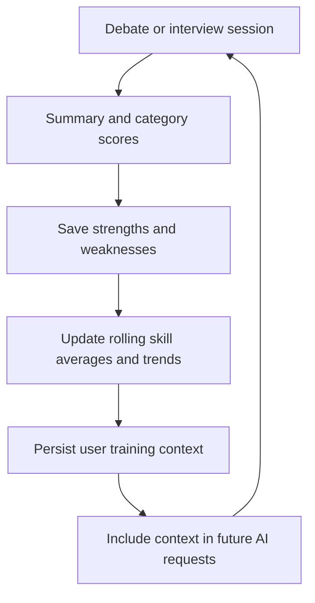

# MindForge — persistent AI training context

**A public implementation of the personalized communication-training loop.**

[Current ArguLab product](https://argulab.netlify.app/dashboard) · [ArguLab documentation](https://github.com/Laabh-Gupta/argu-lab) · [Personalization source](backend/app/services/personalization.py)

This Python/React implementation makes the personalization design inspectable: evaluations update a user's skill profile, persistent context summarizes training needs, and subsequent AI sessions receive that context. It is a separate implementation from ArguLab's TypeScript/Fastify release; the current product's deployment and feature status are documented in the linked ArguLab repository.

## What I built

Debate and interview workflows connect authenticated sessions, saved messages, structured evaluation and a persistent skill profile. The engineering contribution is maintaining and reusing training state across sessions, beyond a single conversational API call.



## Follow the implementation

1. [Evaluation service](backend/app/services/evaluation.py) requests structured feedback using mode-specific rubrics.
2. [Evaluation route](backend/app/routers/evaluations.py) stores summaries, category strengths/weaknesses and scores.
3. [Personalization service](backend/app/services/personalization.py) updates rolling averages/trends and builds cached context from stronger/weaker skill areas.
4. [Session route](backend/app/routers/sessions.py) retrieves the user's context and includes it in opening and subsequent Groq requests.

New users without history receive an empty training-context block. Personalization changes request context; it does not retrain the LLM.

## Stack & boundaries

**React 19 · Vite · Python · FastAPI · Supabase Auth/PostgreSQL · Groq**

The configured conversational/evaluation model is `openai/gpt-oss-120b`. Backend authentication verifies Supabase JWTs. The frontend uses the public anonymous key; the backend service key must remain server-side.

This implementation uses Supabase Auth. ArguLab's separately documented Fastify release uses Better Auth. Do not mix their setup instructions.

## Local setup

The source is inspectable, but a complete database migration/bootstrap is not included. A working Supabase project with the expected tables and appropriate access controls is required before the application can run end to end.

```bash
git clone https://github.com/Laabh-Gupta/MindForge.git
cd MindForge
python -m venv .venv
```

Activate the environment, then:

```bash
python -m pip install -r requirements.txt
```

Create `backend/.env` locally with your own `SUPABASE_URL`, `SUPABASE_SERVICE_KEY` and `GROQ_API_KEY`. Use the backend routes to inspect the expected `sessions`, `messages`, `session_evaluations`, `evaluation_scores`, `skill_scores` and `training_context` data contracts; review all table usage before provisioning.

```bash
cd backend
python -m uvicorn app.main:app --host 127.0.0.1 --port 8000
```

In another terminal, create `frontend/.env.local` with:

```dotenv
VITE_API_BASE_URL=http://127.0.0.1:8000
VITE_SUPABASE_URL=https://YOUR-PROJECT.supabase.co
VITE_SUPABASE_ANON_KEY=YOUR-PUBLIC-ANON-KEY
```

```bash
cd MindForge/frontend
npm install
npm run dev
```

Use the Vite URL, normally `http://localhost:5173`, which matches the backend's local CORS configuration. Configure your own Supabase email/password accounts.

## Limitations

No outcome benchmark, deployment uptime or model fine-tuning is claimed. AI-derived skill scores are coaching signals, not independently validated measures of ability. Database setup is manual; source inspection and local setup instructions do not establish a fully reproduced deployment. See [ArguLab's engineering guide](https://github.com/Laabh-Gupta/argu-lab/blob/main/docs/ENGINEERING.md) for the richer context workflow's integration status.
